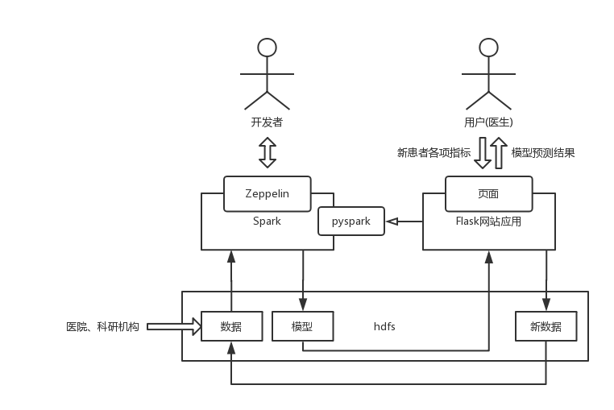
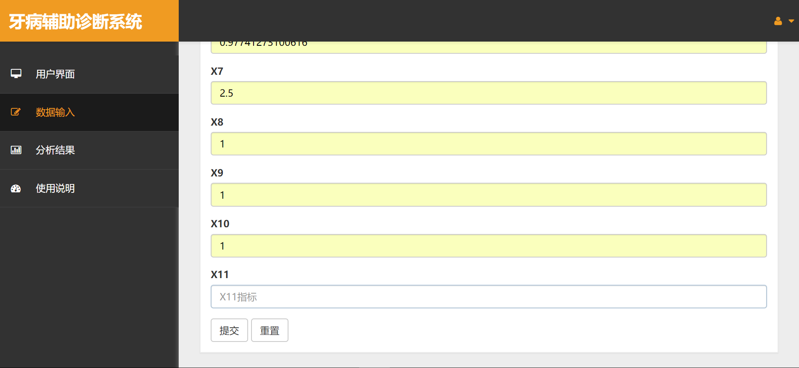
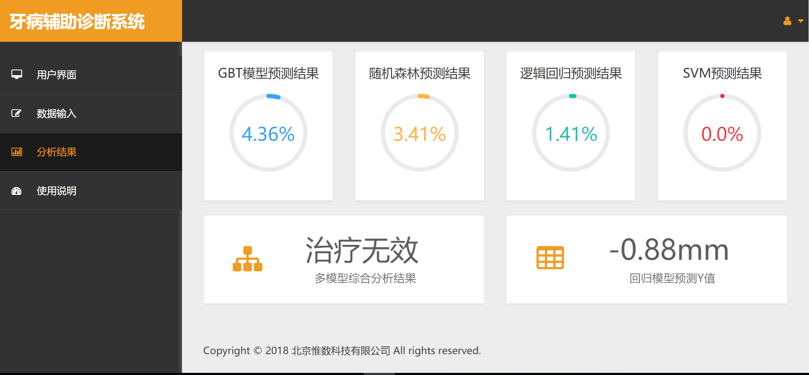

# 合作项目概览简介

## 联系方式
- 手机: (+86) 13311369059
- 微信号: (+86) 13311369059 ( 与手机号相同 )
- Email: leontian1024@gmail.com( Oversea Contact ) || xinyaotian@yeah.net (国内邮箱)
- CSDN 技术博客：https://blog.csdn.net/weixin_38070561
- 知乎技术专栏及个人主页: https://www.zhihu.com/people/winchester-26/activities
- Github：https://github.com/XinyaoTian

## 北京大学- “牙周病辅助诊疗系统” 合作项目
>项目关键词: 大数据、机器学习、信息系统、Web 项目
[项目Web部分内容链接](https://github.com/XinyaoTian/dentist_demo)

### 项目简介

近年来，大数据的跨领域研究受到热烈追捧。本项目由北京大学一名研究牙周病的医学博士发起，提供近 20 年来其部门医师出诊时通过临床诊断所收集到的 170 余万条(经过脱敏)真实牙周病病例的牙位点数据( 共 27 个维度 )，并由我所带领的团队负责机器学习的训练建模部分( 包括数据清洗、预处理、可视化、机器学习建模、模型调参及验证、模型导出及持久化 )的模型构建工作，以及开发一个具有“输入新的病人数据并预测其牙周病严重程度”功能的 Web 服务信息系统原型。

### 项目经历

技术选型方面，模型训练平台我选用的是 Zeppelin，配合底层的 Spark 和 pyspark 工具库可以达到非常优秀的可视化和实时交流协作的目的。几乎每次跑完一个模型，我都可以立刻使用 Zeppelin 将网格搜索交叉验证的结果向博士在线汇报，这种频繁的“汇报-改进”模式能够及时发现问题并立刻作出修改，极大地避免了“开发和需求偏差过大”的风险。Web 服务方面，由于是开发演示版 Demo ，对性能要求不高，且需求较为明确，因此本人选用基于 Python 的 Flask 框架，简单易用，加快开发进度。Web 服务通过 pyspark 调用存储在 hdfs 上训练好的模型来实现“新值预测”的功能。

### 项目成果展示

系统架构宏观设计图

系统演示-病人信息输入界面

系统演示-病人结果预测界面

### 项目影响

项目完成后，博士和公司领导对我的工作给予高度评价；我开发的 Web 服务演示版在答辩时获得了专家组老师们的青睐，有一名专家甚至多次输入了牙位点的各种数值，并将预测结果与其实际临床经验对比，发现仅有微小出入，但是系统的诊断时间只有 5 秒，是传统诊断流程所耗费时间的百分之一，于是便对本系统和机器学习模型产生了浓厚兴趣。

作为本项目的负责人，我还荣幸地成为了该博士论文的作者之一。该论文已投稿给国内某顶级医疗领域期刊，有望在明年发表。

